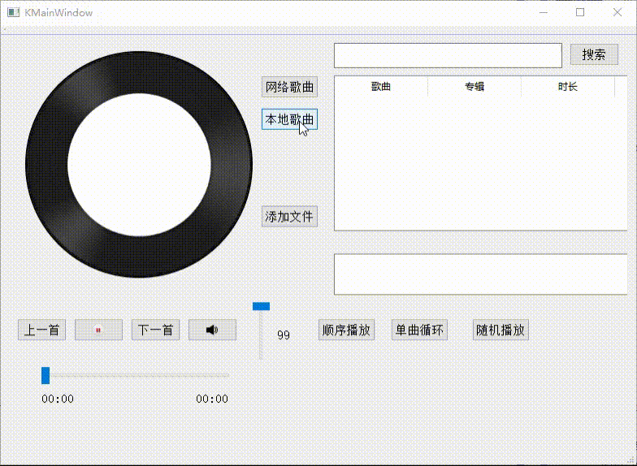

# Qt音乐播放器

一个基于Qt框架的跨平台音乐播放器，支持本地和网络音乐播放。



## 功能特性

- 🎵 **音乐播放控制**
  - 播放/暂停、上一首/下一首
  - 进度条拖拽、音量调节
  - 顺序播放/单曲循环/随机播放模式

- 🌐 **多源播放**
  - 本地音乐文件播放（MP3格式）
  - 网络音乐搜索与播放

- 🎨 **视觉体验**
  - 旋转专辑封面动画
  - 歌词同步显示
  - 系统托盘最小化

- 🛠️ **技术特点**
  - 纯代码构建界面（零.ui文件）
  - 模块化设计，易于扩展
  - 支持Windows/Linux/macOS

## 构建指南

### 环境要求
- Qt 5.15+ (必须包含 Multimedia/Network/Widgets 模块)
- CMake 3.10+
- C++11兼容编译器

### 构建步骤
```bash
# 克隆项目
git clone https://github.com/WoozieDevCUG/Qt_Music_Player.git
cd Qt_Music_Player

# 创建构建目录
mkdir build && cd build

# 生成构建系统（Windows示例）
cmake -G "Visual Studio 16 2019" -A x64 ..

# 编译项目
cmake --build . --config Release

# 运行程序（Windows）
./Release/QtMusicPlayer.exe
